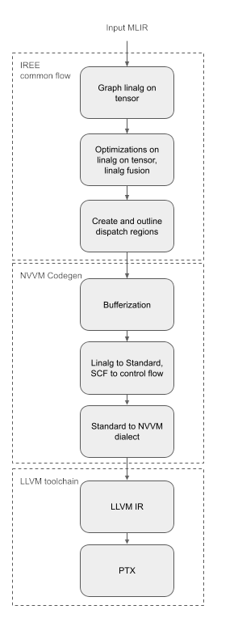
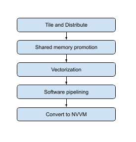
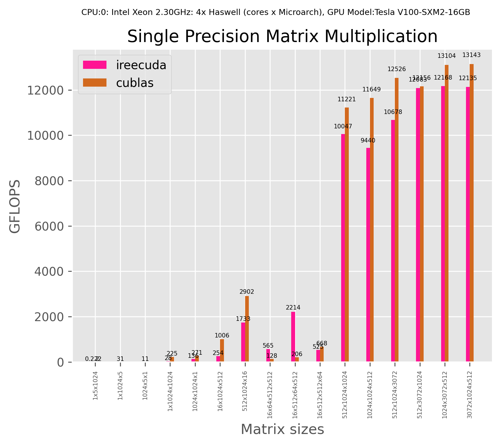

 Tuesday, October 12, 2021<br>
 By Thomas Raoux

# CUDA Backend in IREE

IREE is being designed with re-targetability as a core goal: it should be
possible to use IREE to target a broad spectrum of power regimes, from embedded
systems to distributed clusters; and it should be possible to extend IREE to
target new back-ends without having to reinvent the wheel each time. 

To explore this, we recently branched out from our initial focus on low-latency
mobile deployments with a goal of using IREE to target data center workloads on
Nvidia CUDA. This post describes how we quickly brought up a CUDA back-end for
IREE and used it to train BERT, then shares some metrics and next steps.

## Bring up

### Hal support

IREE has a [HAL API](https://github.com/google/iree/blob/main/docs/developers/design_roadmap.md#hal-hardware-abstraction-layer-and-multi-architecture-executables)
that abstract all the targets behind a common interface. The first to support
CUDA target was to map HAL API onto CUDA. We use CUDA driver API to reduce
dependency and be close to the hardware. The API is close to a typical GPU APIs 
so it was a natural fit for CUDA. HAL API exposes memory allocations, basic fill
and memset commands as well as kernel dispatch, general command buffer handling.
The original implementation uses [CUDA graph API](https://developer.nvidia.com/blog/cuda-graphs/)
as a graph maps naturally to a command buffer. There is also an implementation
using CUDA stream for comparison. 

HAL exposes an API that can be tested independently, even if we are not able to
create CUDA kernels yet we can test a large portion of the CUDA driver using
[CTS tests](https://github.com/google/iree/blob/main/iree/hal/cts/README.md).
Those can be run to make sure a system has the required CUDA support.

 { align=left }

### Compiler support

CUDA has an open source backend in LLVM generating PTX that we are leveraging.
Therefore IREE can create [NVVM](https://docs.nvidia.com/cuda/nvvm-ir-spec/index.html)
(CUDA LLVM variant) and use LLVM has backend to generate PTX. CUDA driver will
do the "last mile compilation" just in time and convert PTX into native isa.

IREE compiler pipeline starts from linalg on tensor representation. A large part
of the compiler is independent of the target.

The linalg on tensor representation of the graph is broken up into dispatch
regions that are processed by NVVM Codegen. A simple implementation of the
compiler is to run bufferization and convert linalg to standard followed by
conversion to NVVM/LLVM. Most of those transformation can re-use upstream MLIR
transformations and share it with any other backend targeting LLVM IR.
Leveraging MLIR conversion to LLVM will allow us to quickly go from a simple
"hello world" to supporting full models.

IREE code generation is based on MLIR infrastructure so each step can easily be
tested independently using the MLIR lit framework.

### Flat buffer definition

Kernels are encoded in a flat buffer containing the PTX code as well as the
workgroup size to use for the dispatch. This allows serialization of the kernels
in the IR, it is then de-serialized by the HAL layer.

```
table CUDAExecutableDef {
  // A map of entry point ordinals to string names as used in the shader
  // library.
  entry_points:[string];

  // Block sizes for each entry point.
  block_sizes:[CUDABlockSizeDef];

  // PTX string of the module.
  ptx_image:string;
}
```

### Hello world

Together those 3 steps are enough to provide most of the functionality and we
can now successfully compile full models.


The steps to reproduce running a simple op end to end through CUDA backend are
described [here](https://github.com/google/iree/blob/main/docs/developers/design_docs/cuda_backend.md#example).

## Performance

Now that we have enabled functionality we need to look at the performance. Once
again we can leverage existing MLIR transformations to speed up the developement
work.

### Tiling and distribution

The first obvious step to get efficient code on CUDA is to make sure we
distribute the work on enough blocks and threads to fill up the GPU. At the time
of bring up not all ops were being tiled and distributed in the common IREE
layer. During dispatch region creation we apply tile and fuse which will
distribute the work into a set of workgroups that are mapped to CUDA blocks.

At the beginning of the code generation we look at the dispatch region and
decide on the tile size for a workgroup. For CUDA we also decide the number of
threads per block. 
We will then have a pass tiling the ops in the dispatch region a second time to
distribute the work onto threads within the block.

At this stage the IR looks like the following:
```
    %8 = "gpu.thread_id"() {dimension = "x"} : () -> index
    %9 = affine.apply affine_map<()[s0] -> (s0 * 4)>()[%8]
    %10 = memref.subview %in0[%9] [4] [1] : memref<128xf32, affine_map<(d0)[s0] -> (d0 + s0)>> to memref<4xf32, affine_map<(d0)[s0] -> (d0 + s0)>>
    %11 = memref.subview %in1[%9] [4] [1] : memref<128xf32, affine_map<(d0)[s0] -> (d0 + s0)>> to memref<4xf32, affine_map<(d0)[s0] -> (d0 + s0)>>
    %12 = memref.subview %out[%9] [4] [1] : memref<128xf32, affine_map<(d0)[s0] -> (d0 + s0)>> to memref<4xf32, affine_map<(d0)[s0] -> (d0 + s0)>>
    linalg.generic {
        indexing_maps = [affine_map<(d0) -> (d0)>,
                         affine_map<(d0) -> (d0)>,
                         affine_map<(d0) -> (d0)>],
        iterator_types = ["parallel"]} 
      ins(%10, %11 : 
          memref<4xf32, affine_map<(d0)[s0] -> (d0 + s0)>>,
          memref<4xf32, affine_map<(d0)[s0] -> (d0 + s0)>>)
      outs(%12 : memref<4xf32, affine_map<(d0)[s0] -> (d0 + s0)>>) {
    ^bb0(%arg1: f32, %arg2: f32, %arg3: f32):  // no predecessors
      %13 = addf %arg1, %arg2 : f32
      linalg.yield %13 : f32
    }
```

### Vectorization

Even though GPUs execute most operations as scalar, memory operations are
optimized to access 128 bits of data per thread. Therefore it is critical to
vectorize load/store operations.
After tiling to a size we vectorize the IR to get vector read/write mapping to
load4/store4. This helps significantly improve the memory access pattern of the
code generated.

This convert the previous IR to:
```
    %8 = "gpu.thread_id"() {dimension = "x"} : () -> index
    %9 = affine.apply affine_map<()[s0] -> (s0 * 4)>()[%8]
    %10 = memref.subview %in0[%9] [4] [1] : memref<128xf32, affine_map<(d0)[s0] -> (d0 + s0)>> to memref<4xf32, affine_map<(d0)[s0] -> (d0 + s0)>>
    %11 = memref.subview %in1[%9] [4] [1] : memref<128xf32, affine_map<(d0)[s0] -> (d0 + s0)>> to memref<4xf32, affine_map<(d0)[s0] -> (d0 + s0)>>
    %12 = memref.subview %out[%9] [4] [1] : memref<128xf32, affine_map<(d0)[s0] -> (d0 + s0)>> to memref<4xf32, affine_map<(d0)[s0] -> (d0 + s0)>>
    %13 = vector.transfer_read %10[%c0], %cst {in_bounds = [true]} : memref<4xf32, affine_map<(d0)[s0] -> (d0 + s0)>>, vector<4xf32>
    %14 = vector.transfer_read %11[%c0], %cst {in_bounds = [true]} : memref<4xf32, affine_map<(d0)[s0] -> (d0 + s0)>>, vector<4xf32>
    %15 = addf %13, %14 : vector<4xf32>
    vector.transfer_write %15, %12[%c0] {in_bounds = [true]} : vector<4xf32>, memref<4xf32, affine_map<(d0)[s0] -> (d0 + s0)>>
```

### Shared memory optimization

Nvidia GPUs have a fast shared memory that needs to be leveraged to optimize
cases where we may be memory bound and have the potential to re-use memory
reads.

For operations like GEMM using shared memory gives us a significant speed up. 
We leverage memory promotion, vector distribution and software pipelining
transformations from MLIR to generate efficient copies from global to shared
memory that can be interleaved with the compute work.

### Optimization pipeline

Those different transformations compose to this flow:



The full dump step by step of a linalg.matmul operation can be found [here](https://gist.github.com/ThomasRaoux/8bded9d7c3f7426fc1ca8598deb53220).

## Results and next steps

### GEMM

We compare the performance of a single GEMM operation to highly optimized
library cuBLAS using [mmperf framework](https://github.com/mmperf/mmperf). 



The graph can be re-produced based on [instructions on mmperf](https://github.com/mmperf/mmperf#compare-mmperf-results-among-different-backends)

### Future work

[Nod.ai](https://nod.ai/) has contributed an experimental HAL module for [ROCM](https://rocmdocs.amd.com/)
that allows us to re-use the compiler parts to support ROCM, more support is
going to be added in the future.

Several performance improvements are still under progress, including optimizing
the runtime allocator to reduce the host-side overhead and tuning tile sizes
based profiling.

Several models are running and we will publish more detailed benchmark results
in the near future.
