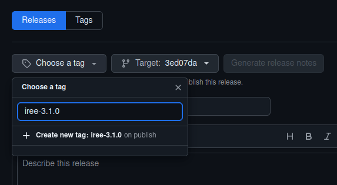
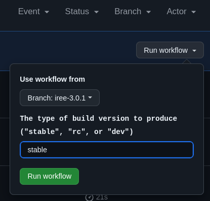

# Release management

IREE cuts automated releases via a workflow that is
[triggered daily](https://github.com/iree-org/iree/blob/main/.github/workflows/schedule_candidate_release.yml).
The only constraint placed on the commit that is released is that it has
[passed certain CI checks](https://github.com/iree-org/iree/blob/main/build_tools/scripts/get_latest_green.sh).
These are published on GitHub with the "pre-release" status. For debugging this
process, see the [Release debugging playbook](../debugging/releases.md).

We periodically promote one of these candidates to a "stable" release by
removing the "pre-release" status. This makes it show up as a "latest" release
on GitHub. We also push the Python packages for this release to PyPI.

All stable (non-prerelease) releases can be viewed at
<https://github.com/iree-org/iree/releases?q=prerelease%3Afalse>.

## Release status

| Package | Release status |
| -- | -- |
GitHub release (stable) | [](https://github.com/iree-org/iree/releases/latest)
GitHub release (nightly) | [](https://github.com/iree-org/iree/releases)
Python iree-base-compiler | [](https://badge.fury.io/py/iree-base-compiler)
Python iree-base-runtime | [](https://badge.fury.io/py/iree-base-runtime)
Python iree-compiler (deprecated) | [](https://badge.fury.io/py/iree-compiler)
Python iree-runtime (deprecated) | [](https://badge.fury.io/py/iree-runtime)

## Running a release

A pinned issue tracking the next release should be filed like
<https://github.com/iree-org/iree/issues/18380>. Developers authoring patches
that include major or breaking changes should coordinate merge timing and
contribute release notes on those issues.

### Picking a candidate to promote

After approximately one month since the previous release, a new release should
be promoted from nightly release candidates.

When selecting a candidate we aim to meet the following criteria:

1. ⪆4 days old so that problems with it may have been spotted
2. Contains no P0 regressions vs the previous stable release
3. LLVM submodule commit ideally exists upstream (no cherry picks or patches)
4. Includes packages for all platforms, including macOS and Windows

When you've identified a potential candidate, comment on the tracking issue with
the proposal and solicit feedback. People may point out known regressions or
request that some feature make the cut.

### Promoting a candidate to stable

1. (Authorized users only) Push to PyPI using
    [pypi_deploy.sh](https://github.com/iree-org/iree/blob/main//build_tools/python_deploy/pypi_deploy.sh)

    * For Googlers, the password is stored at <http://go/iree-pypi-password>

2. Create a new release on GitHub:

    * Set the tag to be created and select a target commit. For example, if the
        candidate release was tagged `iree-3.1.0rc20241119` at commit `3ed07da`,
        set the new release tag `v3.1.0` and use the same commit.

        

        If the commit does not appear in the list, create and push a tag
        manually:

        ```bash
        git checkout iree-3.1.0rc20250107
        git tag -a v3.1.0 -m "Version 3.1.0 release."
        git push upstream v3.1.0
        ```

    * Set the title to `Release vX.Y.Z`.

    * Paste the release notes from the release tracking issue.

    * Upload the `.whl` files produced by the `pypy_deploy.sh` script (look for
        them in your `/tmp/` directory). These have the stable release versions
        in them.

    * Download the `iree-dist-.*.tar.xz` files from the candidate release and
        upload them to the new stable release.

    * Uncheck the option for "pre-release", and check the option for "latest".

        

3. Complete any remaining checkbox items on the release tracking issue then
   close it and open a new one for the next release.

## Creating a patch release

1. Create a new branch.

    Checkout the corresponding stable release and create a branch for the patch release:

    ```shell
    git checkout iree-3.0.0
    git checkout -b iree-3.0.1
    ```

2. Apply and commit the patches.

3. Set the patch level:

    * Adjust `compiler/version.json` if patches are applied to the compiler.

    * Adjust `runtime/version.json` if patches are applied to the runtime.

4. Push all changes to the new branch.

5. Trigger the
    [_Oneshot candidate release_ workflow](https://github.com/iree-org/iree/actions/workflows/oneshot_candidate_release.yml)
    to create a release.

    * Select to run the workflow from the patch branch.

    * Set the type of build version to produce to "stable".

        

6. Follow the documentation above to promote to stable.
   The step to create a new tag can be skipped.
